<div align="center">


# Dopl

**The self-hosted workspace for IT teams.**

Tickets, notes, a shared mailbox, team chat and an AI teammate that asks before it touches a server.<br>
All in one place, on your own hardware.

[](https://github.com/VTKLeuven/dopl/actions/workflows/ci.yml)
[](https://github.com/orgs/VTKLeuven/packages?repo_name=dopl)
[](https://nextjs.org)
[](https://www.postgresql.org)
[](https://www.typescriptlang.org)

[Features](#features) · [Quick start](#quick-start) · [Try it locally](#try-it-locally) · [How it works](#how-it-works) · [Documentation](#documentation)

<br>

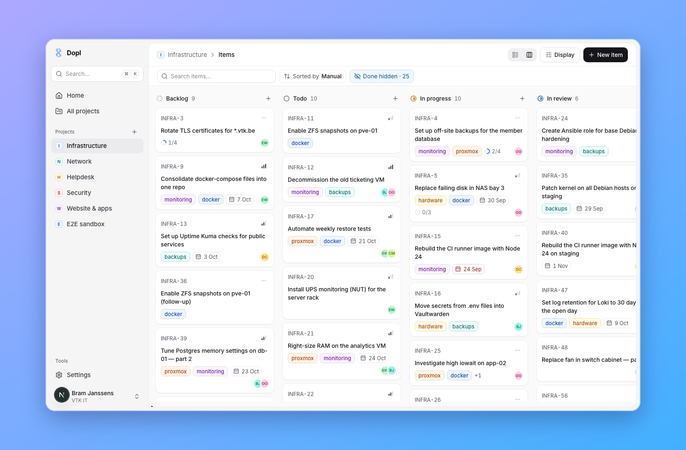

</div>

## Why Dopl

An IT team's work ends up everywhere: requests in a ticket tool, the conversation in a shared inbox, decisions in chat, the to-do in someone's notes app. Dopl keeps it together. A work item links to the emails about it, the chat about it, the notes about it and everything the AI teammate did for it.

- **Email lives next to the tickets.** Connect a shared Gmail mailbox, then assign, snooze and discuss mail, and turn any thread into a work item.
- **Requests come in through your own forms.** Public, embeddable intake forms with a status page per request. Nobody needs an account to file one.
- **Finished work stays out of the way.** Done and cancelled items are hidden by default in every view.
- **The AI teammate asks first.** It runs on your own model, and every command that changes a server waits for a person to approve it.
- **Fast and keyboard-first.** Optimistic updates, live sync between browsers, <kbd>⌘</kbd> <kbd>K</kbd> for everything and single-key shortcuts in lists.

## Features

### Projects, work items and views

List, board, table, calendar and timeline views. Filters with AND/OR groups, saved views per project or across the workspace, swimlanes, bulk edits, sub-items, relations and attachments. Every property edits inline, and the command palette reaches every page and action.

<table>
  <tr>
    <td width="50%">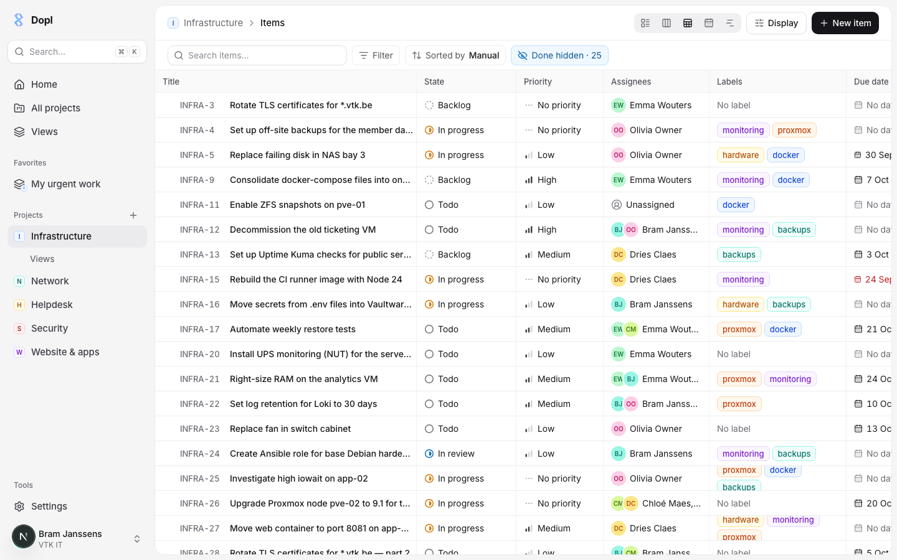<br><sub>Table view: every cell edits inline</sub></td>
    <td width="50%">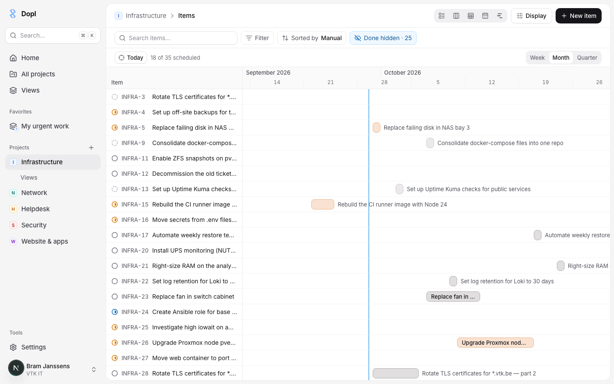<br><sub>Timeline: start and due dates at a glance</sub></td>
  </tr>
  <tr>
    <td>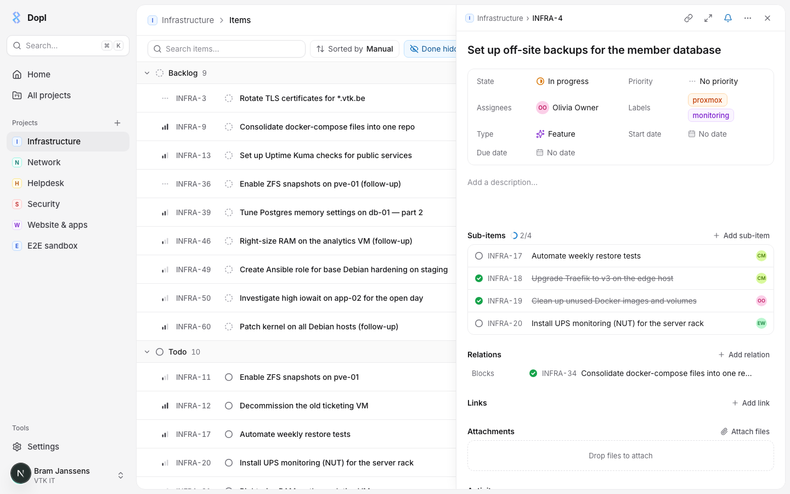<br><sub>Peek at an item without leaving the list</sub></td>
    <td>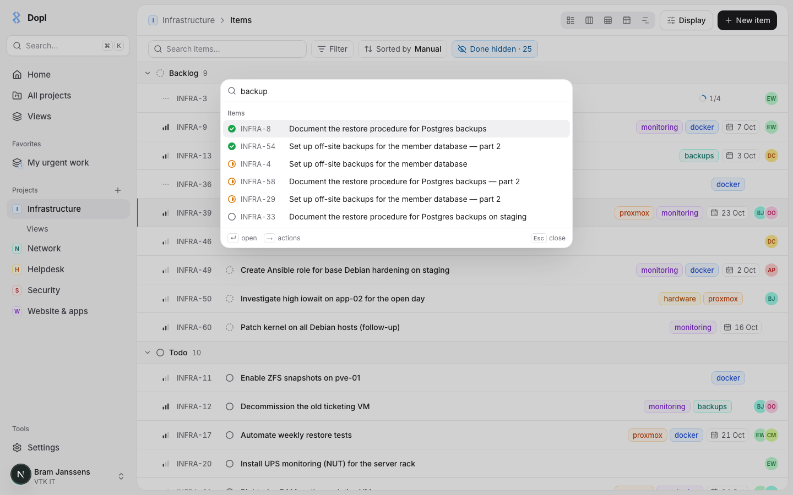<br><sub><kbd>⌘</kbd> <kbd>K</kbd> searches items and runs actions</sub></td>
  </tr>
</table>

### Intake

Build request forms and embed them on any site with one snippet. Requests land in a triage queue where you accept, decline or mark them as duplicates, and the requester follows along on a status page and can reply there. Guests can file requests from inside Dopl, contacts keep every requester's history, a public `/feedback` page lists the forms you choose, and Discord webhooks announce what's new.

<table>
  <tr>
    <td width="50%">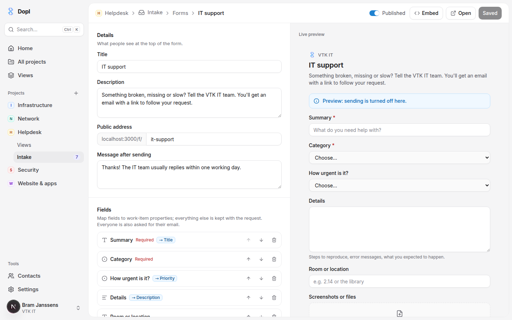<br><sub>Form builder with a live preview</sub></td>
    <td width="50%">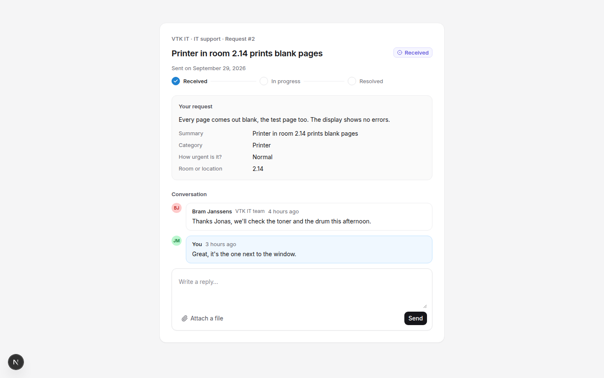<br><sub>The requester's status page</sub></td>
  </tr>
</table>

### Shared mailbox

Bring the team address (say `it@yourdomain.org`) into Dopl. Assign threads, snooze them, leave internal notes, reply from the shared address and turn an email into a work item; the conversation then shows up on the item's timeline. Email HTML is sanitized and rendered in a sandbox. Members can connect their own work mailbox as well, which stays private to them.

<table>
  <tr>
    <td width="50%">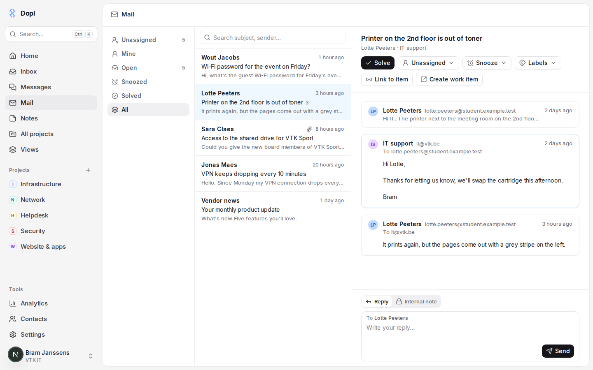<br><sub>Assign, snooze, label and reply</sub></td>
    <td width="50%">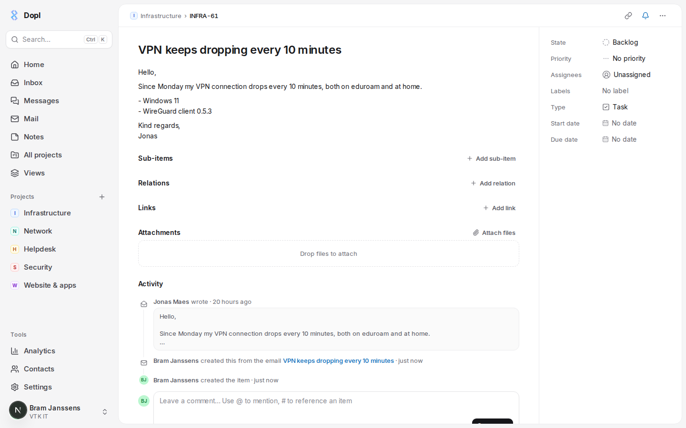<br><sub>An email turned into a work item</sub></td>
  </tr>
</table>

### Inbox and chat

One Inbox for mentions, assignments and updates, with per-type preferences and email digests. Chat has a channel per project, your own public and private channels, DMs, threads, reactions and attachments. Reference an item with `#` and it shows up inline, and any message can become a work item.

<table>
  <tr>
    <td width="50%">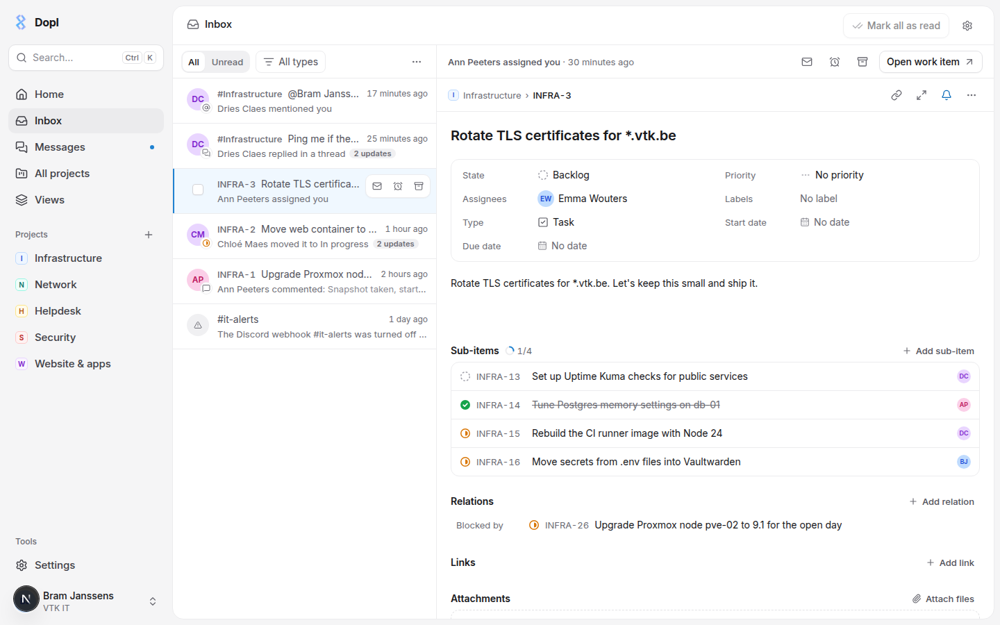<br><sub>Inbox: triage notifications with the item beside them</sub></td>
    <td width="50%">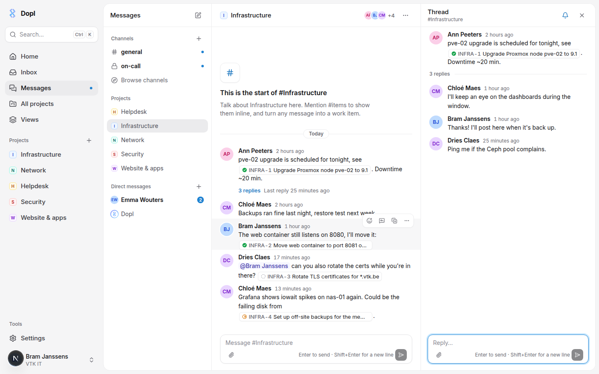<br><sub>Project channels, threads and inline items</sub></td>
  </tr>
</table>

### Notes and My Work

Capture a thought from anywhere with <kbd>Q</kbd>. Notes have nested tags, checklists that roll up into My to-dos, sharing, and a daily review that brings older notes back. Any line of a note becomes a work item in one click. Home puts today's focus, your week, your items and your to-dos on one page.

<table>
  <tr>
    <td width="50%">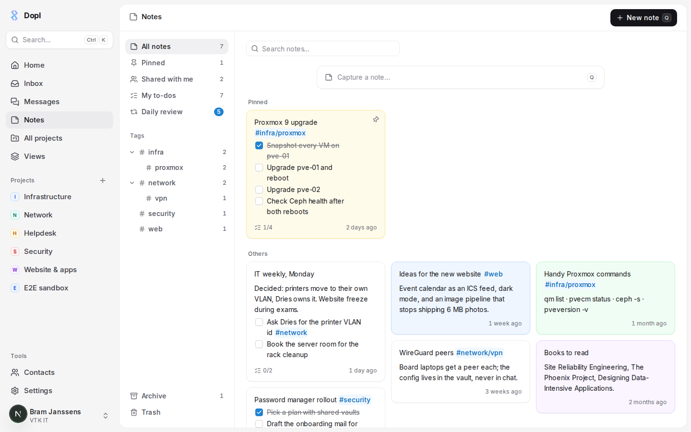<br><sub>Notes with tags, checklists and colours</sub></td>
    <td width="50%">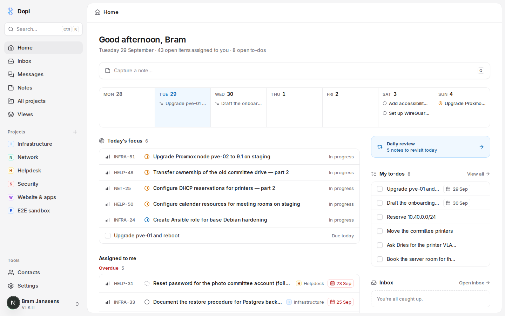<br><sub>Home: everything that's yours today</sub></td>
  </tr>
</table>

### Analytics

A built-in overview for each project and for the whole workspace: created vs. completed, open items by state, priority and project, throughput, cycle and lead time, intake volume and time to triage. Duplicate it, or build your own dashboards with the chart builder.

<table>
  <tr>
    <td width="50%">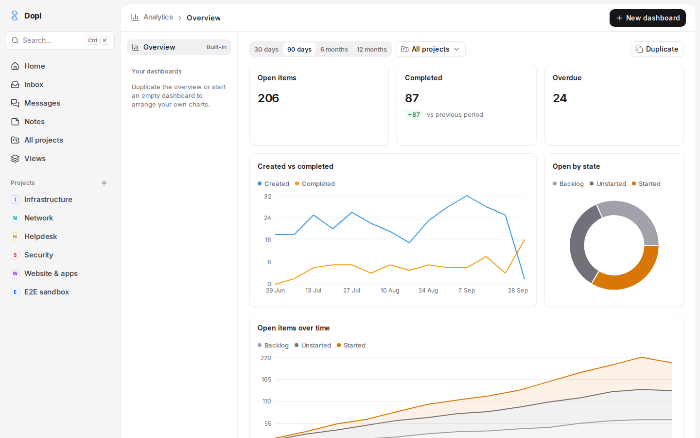<br><sub>The workspace overview</sub></td>
    <td width="50%">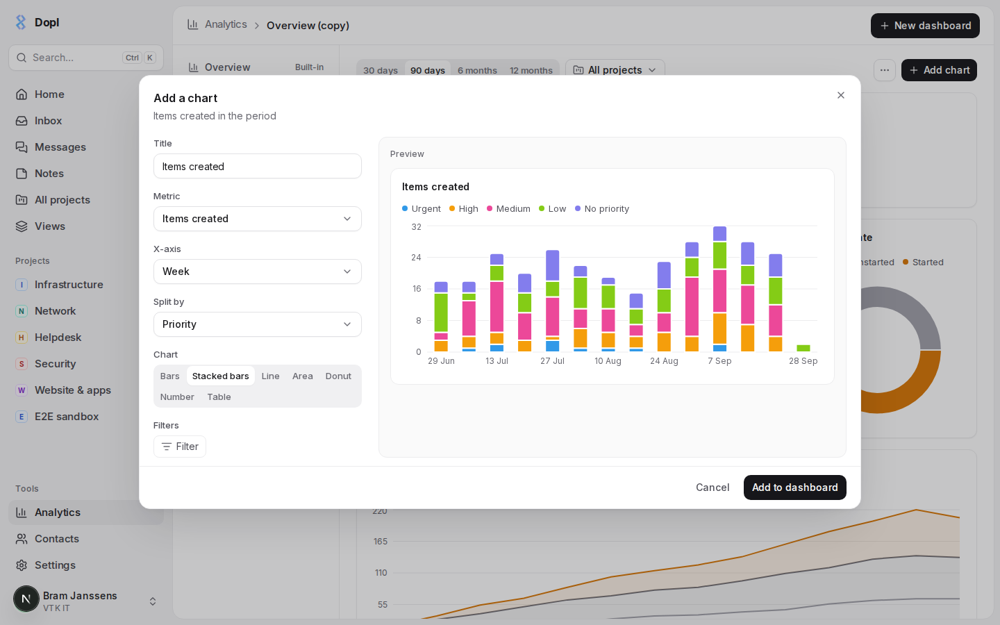<br><sub>Build your own charts and dashboards</sub></td>
  </tr>
</table>

### AI teammate

Dopl comes with a teammate you can @mention, DM or assign an item to. It runs on [Hermes Agent](https://hermes-agent.nousresearch.com) with a model you host yourself, reads and updates work items through Dopl's MCP server, and runs commands on allowlisted servers through a [Warpgate](https://github.com/warp-tech/warpgate) SSH bastion, so every session is recorded.

- **Approval first.** Anything outside a read-only allowlist shows the exact command and host, and waits for a person to approve or deny it.
- **Untrusted input is marked.** Forms and emails are never sent to the agent on their own. When a run reads them, every action in that run needs approval.
- **Stop, pause and audit.** Stop a run, pause the agent everywhere, and find every action in the audit log. Admins can turn approvals off; the host allowlist, deny rules and pause still apply.

<table>
  <tr>
    <td width="50%">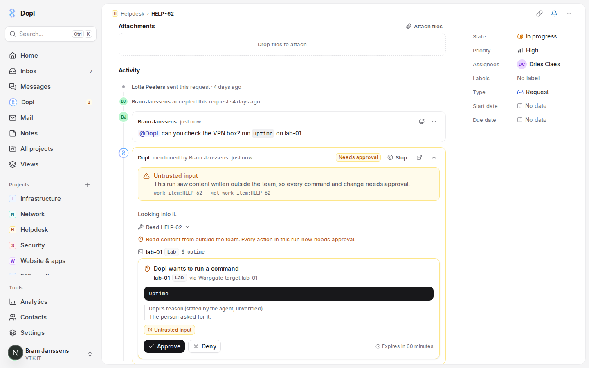<br><sub>Approve or deny the exact command, on the item</sub></td>
    <td width="50%">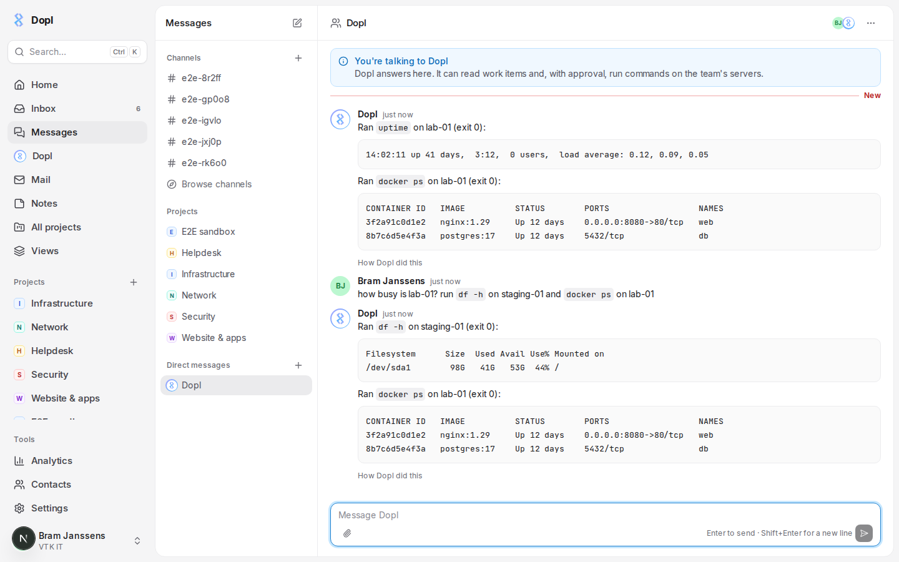<br><sub>Ask it things in a DM</sub></td>
  </tr>
</table>

## Quick start

Dopl ships as Docker images (`ghcr.io/vtkleuven/dopl-{web,worker,migrate}`, amd64 and arm64), so nothing is built on your server. You need:

- a Linux server with Docker 24+ and the compose plugin (2 cores and 4 GB RAM are plenty for a team),
- a domain name pointing at it,
- an SMTP server. Accounts are invite-only, so nobody can join until invite emails arrive.

```bash
git clone https://github.com/VTKLeuven/dopl.git /opt/dopl && cd /opt/dopl
cp .env.production.example .env     # domain, secrets and SMTP: docs/ops/deploy.md §2
./dopl up                            # runs the migrations, then starts everything
./dopl bootstrap you@example.org "Your Name" --workspace "Acme IT" --slug acme
```

`bootstrap` prints a one-time invite link for the owner. Open it, choose a password, set up two-factor authentication and invite your team from **Settings → Members**.

The **[deployment guide](docs/ops/deploy.md)** covers the rest: HTTPS with the bundled Caddy or your own reverse proxy, nightly backups and restores, updates, and what to do when something goes wrong. The `./dopl` script wraps Docker Compose:

| Command                         | What it does                                                      |
| ------------------------------- | ----------------------------------------------------------------- |
| `./dopl up`                     | Start, or apply changes to `.env`. Migrations run first.          |
| `./dopl update [tag]`           | Pull the latest images (or a commit SHA) and restart.             |
| `./dopl status` / `logs [svc]`  | Container health, and logs per service.                           |
| `./dopl backup` / `restore …`   | Back up now, or restore a database dump and the uploads.          |
| `./dopl bootstrap EMAIL "NAME"` | Create the workspace and print the owner's invite link.           |
| `./dopl deploy SHA`             | What CI runs to deploy a green commit from `main` (deploy.md §7). |

Everything else is optional and can wait: the shared mailbox ([gmail-setup.md](docs/ops/gmail-setup.md)), the AI teammate ([agent-setup.md](docs/ops/agent-setup.md)), Google sign-in and SSO ([deploy.md §8](docs/ops/deploy.md)) and Discord webhooks (**Settings → Integrations**).

## Try it locally

You need Node 24 (`.nvmrc`), pnpm 10 (through corepack) and Docker.

```bash
pnpm i
cp .env.example .env          # fill in BETTER_AUTH_SECRET and DOPL_ENCRYPTION_KEY (openssl rand -base64 32)
pnpm db:up                    # Postgres 17 + pgvector on :54320, Mailpit on http://localhost:8025
pnpm db:deploy && pnpm db:generate
pnpm db:seed                  # a demo workspace with projects, notes, mail and the agent
pnpm dev                      # web on http://localhost:3000, plus the worker
```

Sign in at <http://localhost:3000/sign-in> as `bram@dopl.test` with password `dopl-dev-password`.

> [!TIP]
> You can try the mailbox and the AI teammate without Google, Hermes or any servers. Turn on the fakes in `.env` before seeding: `GMAIL_FAKE_DIR=.data/fake-gmail`, `HERMES_FAKE_PORT`, `HERMES_FAKE_MCP_TOKEN` and `AGENT_EXEC_FAKE=true` (see `.env.example`). The e2e tests need them too.

| Check            | What it runs                                         |
| ---------------- | ---------------------------------------------------- |
| `pnpm typecheck` | `tsc` across the workspace                           |
| `pnpm lint`      | ESLint and Prettier                                  |
| `pnpm test`      | Vitest, unit and integration against a test database |
| `pnpm e2e`       | Playwright against `pnpm dev` and the seeded data    |
| `pnpm db:drift`  | Checks that the migrations match the Prisma schema   |

CI runs all of them on every push and pull request, and publishes the Docker images from `main`.

## How it works

Dopl is a modular monolith: a Next.js app, a background worker and PostgreSQL, which doubles as the job queue and the realtime bus. There's no Redis and no separate search engine to run.

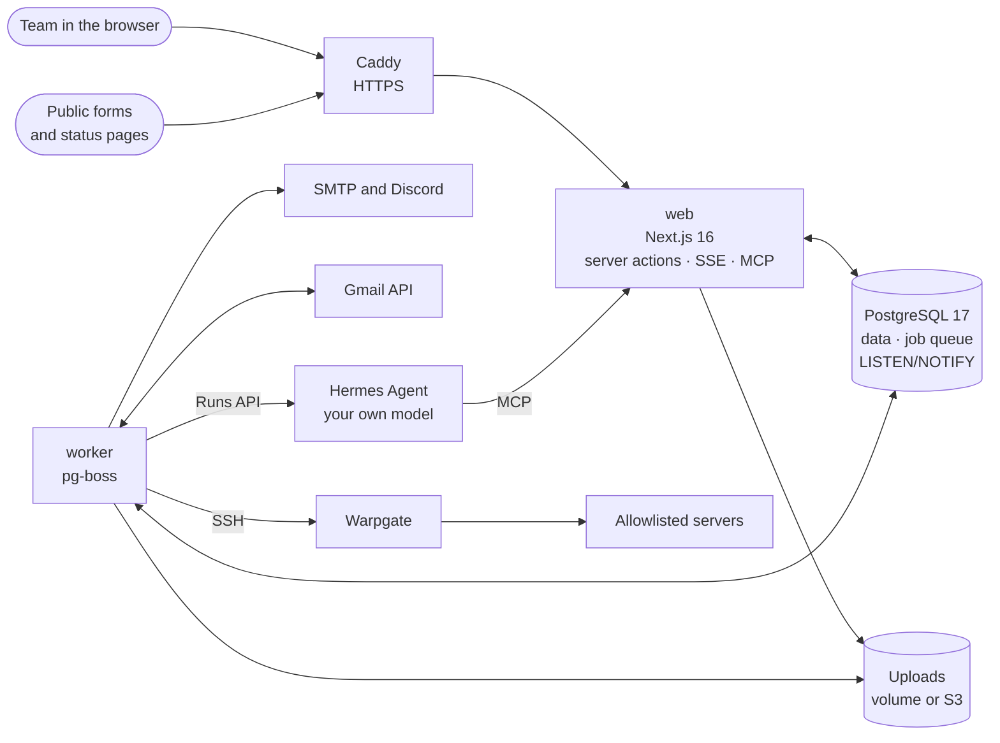
```mermaid
flowchart LR
  B([Team in the browser]) --> C[Caddy<br/>HTTPS]
  F([Public forms<br/>and status pages]) --> C
  C --> W["web<br/>Next.js 16<br/>server actions · SSE · MCP"]
  W <--> P[("PostgreSQL 17<br/>data · job queue<br/>LISTEN/NOTIFY")]
  K["worker<br/>pg-boss"] <--> P
  W & K --> U[("Uploads<br/>volume or S3")]
  K --> E[SMTP and Discord]
  K <--> G[Gmail API]
  K -- Runs API --> H[Hermes Agent<br/>your own model]
  H -- MCP --> W
  K -- SSH --> WG[Warpgate] --> S[Allowlisted servers]
```

**Built with** Next.js 16 and React 19, TanStack Query and Table, Tailwind CSS v4, Recharts, Prisma 7 on PostgreSQL 17 (pgvector, pg_trgm), pg-boss 12, Better Auth and the Model Context Protocol SDK.

**Security, by design:**

- Accounts are invite-only for every sign-in method: email and password, magic links, Google and SSO. Owners and admins must use two-factor authentication.
- Authorization lives in one policy module and is enforced on the server. Every change writes its activity, its realtime event and its jobs in the same transaction.
- Sign-ins, roles, settings, mailboxes and agent actions go to an append-only audit log, enforced by a database trigger.
- Google and SSH credentials live only in the worker. The agent reaches Dopl only through MCP, with a scoped token.

## Documentation

| Document                                                                                               | What's in it                                                        |
| ------------------------------------------------------------------------------------------------------ | ------------------------------------------------------------------- |
| [Deployment guide](docs/ops/deploy.md)                                                                 | Server setup, HTTPS, backups, updates, troubleshooting              |
| [Gmail setup](docs/ops/gmail-setup.md)                                                                 | Connecting the shared mailbox                                       |
| [AI teammate setup](docs/ops/agent-setup.md)                                                           | Hermes, Warpgate, hosts and command rules                           |
| [Architecture](docs/ARCHITECTURE.md)                                                                   | Components, request flow, realtime, jobs, auth, the agent, security |
| [Data model](docs/DATA_MODEL.md)                                                                       | The schema, its invariants and indexes                              |
| [Design system](docs/DESIGN_SYSTEM.md)                                                                 | Tokens, components, layouts and the keyboard map                    |
| [Decisions](docs/DECISIONS.md)                                                                         | Why things are the way they are                                     |
| [Roadmap](docs/ROADMAP.md) · [Changelog](docs/CHANGELOG.md) · [Open questions](docs/OPEN_QUESTIONS.md) | What's planned, what's done and what's still undecided              |
| [Handoff](docs/HANDOFF.md)                                                                             | Where the project stands right now                                  |

<details>
<summary><b>Repository layout</b></summary>

| Path              | What                                                                                        |
| ----------------- | ------------------------------------------------------------------------------------------- |
| `apps/web`        | Next.js app: pages, server actions, the realtime stream, public forms, the MCP server       |
| `apps/worker`     | pg-boss worker: email, Gmail sync, webhooks, digests, analytics snapshots, agent runs       |
| `packages/db`     | Prisma 7 schema, migrations, seed, bootstrap                                                |
| `packages/shared` | zod schemas, policy (authorization), domain logic shared by web and worker                  |
| `packages/server` | Server-only code shared by web and worker (storage, notifications, webhooks, agent helpers) |
| `docker/`         | Production compose file, Dockerfile, Caddyfile, backup scripts                              |
| `docs/`           | The plan and its decisions, ops guides, screenshots per phase                               |

</details>

## Status

Dopl is built for, and used by, the IT team of [VTK Leuven](https://vtk.be). All of the features above are built and tested. Two integrations have so far only run against the fakes used in development and CI: Gmail sync against a real Google mailbox, and the AI teammate against a real Hermes server. If you try Dopl for your own team, we'd love to hear how it goes.

## Contributing

Issues and pull requests are welcome.

- Branch off `main` and keep commits small, with an imperative subject ("Add board drag between columns").
- Run `pnpm typecheck`, `pnpm lint` and `pnpm test` before you push. UI changes come with screenshots.
- [CLAUDE.md](CLAUDE.md) has the coding conventions. It's written for AI assistants, but it's also the shortest summary for people. Non-obvious choices get an entry in [DECISIONS.md](docs/DECISIONS.md).

## Acknowledgements

[Plane](https://github.com/makeplane/plane) and [Blinko](https://github.com/blinkospace/blinko) inspired the product; no code, schemas, styles or assets were copied from them. [Hermes Agent](https://hermes-agent.nousresearch.com) runs as a separate service.
