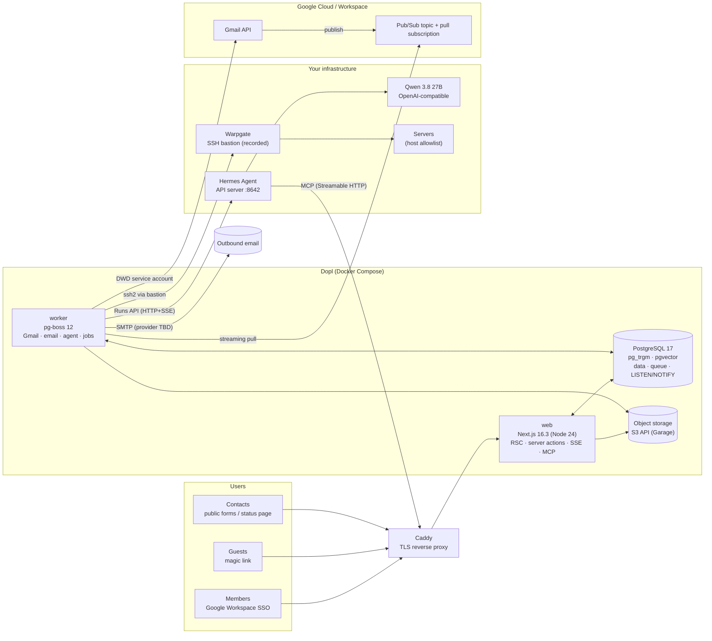
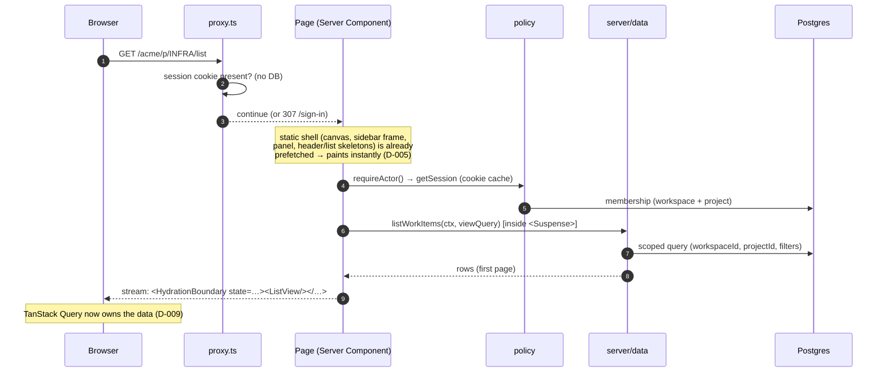
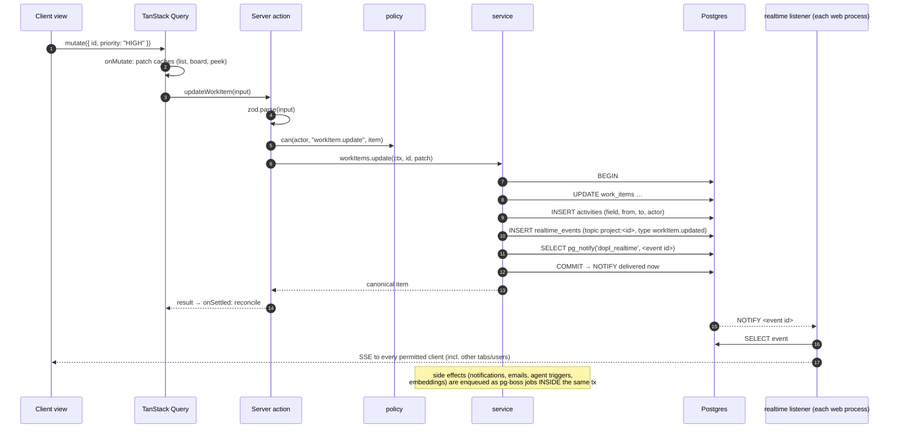
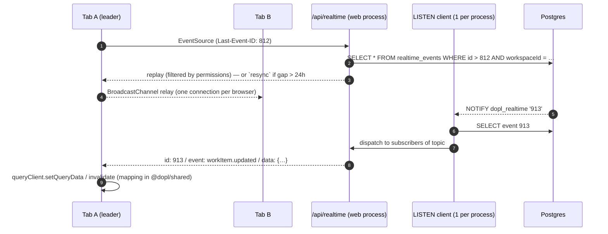
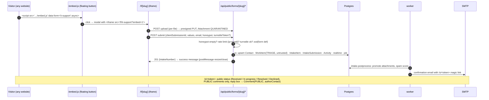
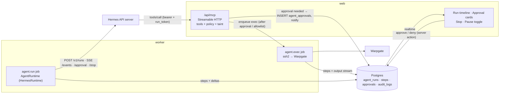
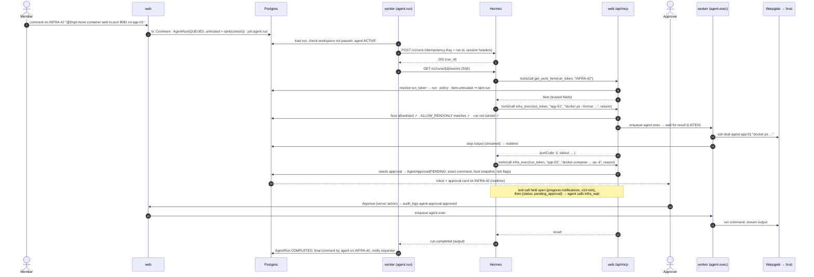
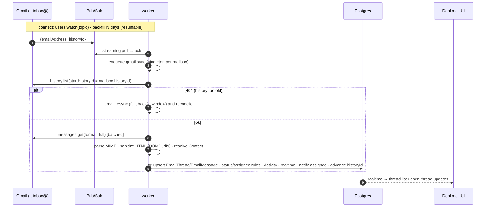
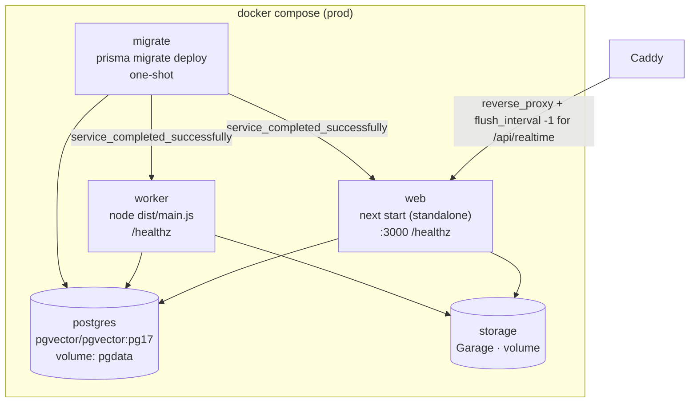

# Dopl: architecture

> Status: Phase 0 plan. The *why* behind each choice lives in `docs/DECISIONS.md` (D-xxx references). The data model is in `docs/DATA_MODEL.md`.

## 1. Overview

Dopl is a modular monolith: one Next.js 16.3 app (`web`), one background worker (`worker`) and one PostgreSQL 17 database that also acts as the job queue, the realtime bus and the search index. There is no Redis. Everything is self-hosted with Docker Compose behind your existing Caddy.



**Trust zones:**
- **Internet:** contacts hit only `/f/*`, `/s/*`, `/embed.js` and `/api/public/*`.
- **Members and guests:** everything else, behind sign-in (and ideally your VPN, Q-4).
- **Worker:** the only process holding Google and SSH credentials (D-027).
- **Hermes:** reaches Dopl only through the MCP endpoint, with a scoped token (D-032).

## 2. Repository layout and module boundaries

```
dopl/
├─ apps/
│  ├─ web/                         Next.js app (@dopl/web)
│  │  ├─ messages/                 next-intl catalogues (en.json, nl.json)
│  │  ├─ public/                   favicons & app icons generated from assets/brand
│  │  ├─ e2e/                      Playwright specs (+ instant() tests, visual snapshots)
│  │  └─ src/
│  │     ├─ app/
│  │     │  ├─ (auth)/sign-in/     sign-in page (Google + guest magic link)
│  │     │  ├─ (public)/f/[slug]/  public intake form (static shell, 'use cache')
│  │     │  ├─ (public)/s/[token]/ contact status page
│  │     │  ├─ (app)/[ws]/…        the product (root param `ws` = workspace slug)
│  │     │  ├─ dev/ui/             component gallery (dev + preview builds only)
│  │     │  └─ api/                auth, realtime (SSE), mcp, public/*, files/*, healthz
│  │     ├─ proxy.ts               optimistic auth redirect + security headers (D-007)
│  │     ├─ components/ui/         re-themed shadcn primitives (Button, Popover, …)
│  │     ├─ components/            product components (StateIcon, PropertyPill, Board…)
│  │     ├─ features/<feature>/    client views, hooks, mutations per feature
│  │     ├─ server/
│  │     │  ├─ auth.ts             Better Auth instance + getActor()
│  │     │  ├─ policy/             ← the ONLY place authorization decisions are made
│  │     │  ├─ data/               scoped reads (take Ctx, never raw ids from client)
│  │     │  ├─ services/           domain mutations: tx + Activity + realtime outbox
│  │     │  ├─ actions/            'use server' entry points (zod → policy → service)
│  │     │  ├─ realtime/           LISTEN connection, SSE fan-out, permission filter
│  │     │  └─ mcp/                MCP server + tools
│  │     └─ lib/                   client utils, query-key factory re-exports
│  └─ worker/                      pg-boss worker (@dopl/worker)
│     └─ src/
│        ├─ jobs/                  one file per queue (gmail.sync, email.send, agent.run…)
│        ├─ gmail/                 client (DWD), sync engine, MIME/HTML sanitizer
│        ├─ agent/                 AgentRuntime + HermesRuntime adapter, SSH executor
│        ├─ email/                 Mailer (SMTP) + outbox processor
│        └─ schedules.ts           cron registrations
├─ packages/
│  ├─ db/                          @dopl/db
│  │  ├─ prisma/schema.prisma      the full schema (all phases)
│  │  ├─ prisma/migrations/        Prisma + hand-written *_manual_* migrations (D-015)
│  │  ├─ prisma.config.ts          datasource URL, migrations path, seed command
│  │  └─ src/
│  │     ├─ client.ts              PrismaClient + PrismaPg adapter (pool settings D-010)
│  │     ├─ generated/prisma/      generated client (git-ignored)
│  │     ├─ search/                raw-SQL access to search.embeddings (D-017)
│  │     └─ seed/                  realistic seed (projects, ~300 items, members…)
│  └─ shared/                      @dopl/shared (no Node-only or React deps in core)
│     └─ src/
│        ├─ schemas/               zod schemas: entities, action inputs, filter AST
│        ├─ domain/                pure logic: identifiers, fractional keys, state
│        │                         transitions, filter → Prisma where compiler,
│        │                         mention/#ref extraction, todo projection, taint rules
│        ├─ policy/                pure permission functions (used by web + worker)
│        ├─ realtime/              event type definitions + query-key mapping
│        ├─ query-keys.ts          TanStack Query key factory
│        ├─ i18n/                  message types
│        └─ emails/                React Email templates (D-045)
├─ docker/                         Dockerfiles, compose files, Caddy snippet
└─ docs/
```

**Dependency rules** (enforced by ESLint `no-restricted-imports` and package `exports`):
- `shared` depends on nothing internal. `db` depends on `shared` for types only. `web` and `worker` depend on both.
- React components never import `@dopl/db`. Only `server/**` and the worker do.
- Nothing imports `server/data` or `server/services` without a `Ctx`. The type system forces the policy check to have happened: `Ctx` is only produced by `requireActor()` and `requireWorkspace()`.

**URLs:**

| Route | Page |
|---|---|
| `/{ws}/home` | My Work |
| `/{ws}/inbox` | Inbox |
| `/{ws}/p/{IDENT}/{list\|board\|calendar\|table\|timeline}` | Project views |
| `/{ws}/p/{IDENT}/intake` | Intake queue |
| `/{ws}/v/{viewId}` | Saved views |
| `/{ws}/i/{IDENT-123}` | Full work-item page |
| `/{ws}/notes` | Notes |
| `/{ws}/messages/{channel}` | Messages |
| `/{ws}/mail/{mailbox}/{view}` | Shared mailbox |
| `/{ws}/analytics` | Analytics |
| `/{ws}/settings/…` | Settings |

The **peek panel** is URL state (`?peek=INFRA-42`, via nuqs) rendered client-side on top of any view. It opens instantly from cached list data, loads the rest, and gives every view a shareable link.

## 3. Request lifecycle

### 3.1 First load (Server Components + streaming)



### 3.2 Mutation (optimistic, audited, broadcast)



**Every mutation, without exception, does four things:**
1. validates its input with zod
2. calls the policy
3. writes an `Activity` row
4. writes a `realtime_events` row

All of it happens in one transaction. The service layer provides a `withMutation(ctx, fn)` helper that does 3 and 4, so individual services can't forget them.

Bulk actions share one `batchId` and emit one grouped realtime event.

## 4. Realtime



- **Topics:**
  - `workspace:<id>`: members, projects, labels
  - `project:<id>`: work items, states, intake
  - `workItem:<id>`: comments, activity, agent run steps
  - `user:<id>`: notifications, approvals for approvers
  - `channel:<id>`: messages, typing
  - `mailbox:<id>`: threads, presence
- **Permission filter:** each connection keeps a small in-memory permission snapshot (accessible project ids, channel ids, mailbox ids). It's refreshed when a membership event arrives, so fan-out needs no database lookup per event.
- **Payloads** are small: an entity id plus changed fields. Clients refetch when they need more.
- **Ephemeral events:** chat typing uses `pg_notify('dopl_ephemeral', json)` and is never stored. Collision presence ("Sam is replying") uses heartbeat rows in `presences` (15 s interval, 45 s TTL) plus a NOTIFY.
- **Keepalive:** a `: ping` comment every 20 s. Caddy needs `flush_interval -1` on the SSE route.

## 5. Background jobs (pg-boss)

| Queue | Trigger | Notes |
|---|---|---|
| `notifications.fanout` | enqueued by services | Resolves recipients (subscribers, mentions, assignees, approvers), applies preferences, inserts `notifications` and emits `user:<id>` events |
| `email.send` | outbox row | SMTP send with retries/backoff; dead-letter after 5 attempts |
| `email.digest` | schedule, every 10 min | Batches unread notifications per user preference |
| `intake.postprocess` | after a public submit | Spam signals, attachment promotion (quarantine → ready), confirmation email |
| `gmail.pubsub` | long-running consumer | Streaming pull; each message → `gmail.sync` (singleton per mailbox) |
| `gmail.sync` | Pub/Sub, poll, manual | `history.list` → batched `messages.get(full)` → upsert; 404 → `gmail.resync` |
| `gmail.backfill` / `gmail.resync` | connect / gap | Resumable via `backfillPageToken` |
| `gmail.watch-renew` | schedule, daily | `users.watch` per active mailbox |
| `gmail.poll` | schedule, every 5 min | Safety net if Pub/Sub is quiet |
| `gmail.fetch-attachment` | web request | Download → blob store → NOTIFY result |
| `gmail.send` (Phase 7b) | reply action | RFC 822 with `In-Reply-To`/`References`, `threadId` |
| `agent.run` | mention / DM / assignment | Starts the Hermes run, consumes SSE, persists steps (§8) |
| `agent.exec` | approved or allowlisted command | SSH via Warpgate, streams output |
| `embeddings.index` | note/item saved (debounced) | Calls the AI server's embeddings endpoint, upserts `search.embeddings` |
| `snooze.wake` | schedule, every minute | Snoozed intake, threads and notifications come back; notifies |
| `notes.review` | schedule, daily | Picks the daily resurfacing set per user |
| `analytics.snapshot` | schedule, nightly | `project_daily_stats` |
| `maintenance.purge` | schedule, nightly | Hard-delete soft-deleted rows > 30 d; prune `realtime_events` > 24 h, `presences`, `rate_limit_counters` |

Jobs are idempotent: upserts keyed on natural ids, singleton keys and "already done?" checks. Web enqueues jobs inside the mutation's transaction using pg-boss's `db` option with the Prisma transaction's connection. If that proves awkward, a `job_outbox` pattern is the fallback. Either way, a job exists if and only if the change committed.

## 6. Public surface: intake forms, embeds, status page



- **Iframe snippet:** `<iframe src="https://dopl.example/f/<slug>?embed=1" style="width:100%;height:640px;border:0" loading="lazy">`. `frame-ancestors` comes from the form's `allowedEmbedOrigins` (an empty list means any origin).
- **JS snippet:** `embed.js` is a small vanilla-JS file under 4 KB. It injects the floating button (text, position and accent from the form theme), opens the iframe in a modal, and listens for `postMessage` `{type: "dopl:resize"|"dopl:close"}`, checking the origin.
- **Spam protection:**
  - a honeypot field
  - a minimum time-to-submit (2 s)
  - per-IP and per-email fixed windows (D-025)
  - optional Cloudflare Turnstile verified server-side
  - a blocked-contacts list
  - attachment limits (size, MIME allowlist, count) enforced at presign time and again on confirm
- **Status-page statuses** are derived from the work item's state group, and the internal state names are never shown (Q-12).

## 7. Authentication and authorization

**Authentication (D-026):**

| Actor | How | Session |
|---|---|---|
| Member | Google OAuth via Better Auth (`hd` claim + domain hook) | Better Auth DB session, httpOnly cookie, 5-min cookie cache |
| Guest | Better Auth magic link (invite-only, `disableSignUp`) | same |
| Contact | Per-submission token in the confirmation email | Short-lived signed cookie scoped to `/s/*` |
| Agent | MCP bearer token (`api_tokens`, hashed) + per-run token | stateless |

**Authorization:** `@dopl/shared/policy` holds pure functions such as `can(actor, action, resource)`. They're unit-tested exhaustively and are also used by the worker. `apps/web/src/server/policy` loads the needed memberships once per request (cached with React `cache()`) and exposes `authorize(ctx, action, resource)`, which throws `Forbidden`. UI checks exist only to hide buttons.

| Capability | Owner | Admin | Member | Guest |
|---|:-:|:-:|:-:|:-:|
| Workspace settings, members, mailboxes, agent config, hosts, allowlists | ✓ | ✓ | – | – |
| Create projects | ✓ | ✓ | ✓ | – |
| Project settings (states, labels, forms, members) | ✓ | ✓ | project Admin | – |
| Read/write work items in accessible projects | ✓ | ✓ | ✓ | – |
| Submit intake in-app; see and comment (PUBLIC) on **own** submissions | ✓ | ✓ | ✓ | ✓ |
| Read-only project browsing | ✓ | ✓ | ✓ | if `guestsCanViewProject` |
| Triage intake | ✓ | ✓ | ✓ | – |
| Use shared mailbox | ✓ | ✓ | if mailbox member | – |
| Approve agent infra actions | ✓ | ✓ | if `canApproveAgentActions` (Q-8) | – |
| Pause agent (kill switch) | ✓ | ✓ | ✓ (stop own-triggered runs; global pause Admin+) | – |
| View/export audit log | ✓ | ✓ | – | – |

Guests are **never** shown INTERNAL comments, other people's submissions, members' emails or activity from internal fields. The status-page and guest serializers are separate functions with explicit allowlists of fields, not "hide some fields" filters.

## 8. AI teammate

### 8.1 Components



### 8.2 `AgentRuntime` interface (in the worker)

```ts
export interface AgentRuntime {
  readonly kind: "HERMES";
  capabilities(): Promise<RuntimeCapabilities>;           // GET /v1/capabilities
  startRun(input: {
    runId: string;               // AgentRun.id → Idempotency-Key
    sessionId: string;           // e.g. dopl:workItem:<id>
    sessionKey: string;          // stable memory scope
    instructions: string;        // system prompt incl. run_token + rules
    input: string;               // the user's request + trusted context
  }): Promise<{ runtimeRunId: string }>;
  events(runtimeRunId: string, signal: AbortSignal): AsyncIterable<RuntimeEvent>;
  resolveApproval(runtimeRunId: string, requestId: string, choice: "once" | "deny"): Promise<void>;
  stop(runtimeRunId: string): Promise<void>;
  status(runtimeRunId: string): Promise<RuntimeRunStatus>; // reconcile after worker restart
}

export type RuntimeEvent =
  | { type: "message.delta"; text: string }
  | { type: "message.interim"; text: string }
  | { type: "tool.started"; tool: string; preview: string }
  | { type: "tool.completed"; tool: string; error: boolean; preview: string; durationSec: number }
  | { type: "approval.requested"; requestId: string; command?: string; description?: string; choices: string[] }
  | { type: "approval.cancelled"; requestId: string; reason: string }
  | { type: "run.completed"; output: string; usage?: unknown }
  | { type: "run.failed" | "run.cancelled" | "run.interrupted"; error?: string };
```

`HermesRuntime` maps Hermes's `/v1/runs/{id}/events` stream onto these types (`tool.started`, `tool.completed`, `approval.request`, `message.delta`, `run.*`). SSE comment lines (`: keepalive`) are skipped.

### 8.3 A run, end to end



### 8.4 Safety controls (all enforced server-side)

| Control | Where |
|---|---|
| Human approval for every infrastructure change: exact command + target host shown, approver and time logged | `infra_exec` → `agent_approvals` + `audit_logs` (D-031) |
| Read-only allowlist (anchored regex over the full command; compound commands never match implicitly) | `agent_command_rules` (ALLOW_READONLY / DENY), per host or global |
| Host allowlist; dedicated low-privilege SSH user/key via Warpgate (session recording); no root keys | `agent_hosts` + worker-only key (D-027) |
| No secrets in prompts: prompts are built from ids and trusted text only; command output is shown to the agent but redacted with secret patterns before storage/display | worker prompt builder + output redactor |
| Prompt-injection boundary: untrusted content never auto-sent; taint-on-read; tainted run ⇒ every action approved | D-033 |
| Kill switch: Stop on a run (→ `/v1/runs/{id}/stop`, cancel pending approvals, kill SSH channel); global Pause (Workspace.agentPausedAt) refuses new runs and every `infra_exec` | web + worker + MCP |
| Full audit trail, exportable (CSV/JSON) | `audit_logs` (append-only trigger) + `agent_runs/steps` |
| Hermes hardening (documented in the ops guide): API server bound to a private interface, strong `API_SERVER_KEY`, terminal toolset disabled, `approvals.mode: manual`, Dopl MCP server entry with `timeout: 900` | Hermes config |

## 9. Shared mailbox (Gmail)



- **Views:** Unassigned, Mine, Open, Snoozed (`snoozedUntil > now`), Solved, All. Internal `EmailComment`s are interleaved by time and styled differently (tinted background, a lock icon, "Internal").
- **Promote to work item** creates a WorkItem (`origin: EMAIL`, `untrusted: true`) plus a `WorkItemReference(kind: CREATED_FROM, emailThreadId)`. **Link to existing** creates a `LINKED` reference. Either way the thread appears on the item's timeline, and new replies keep appearing there live.
- **Collision:** `presences` rows for `emailThread:<id>` show "Sam is viewing" or "Sam is replying…" avatars.
- **Reopen rule:** a new inbound message on a SOLVED thread reopens it and notifies the assignee.
- **Label mirroring** (optional): the worker keeps `Dopl/Open` and `Dopl/Solved` Gmail labels in sync (`gmail.modify`).
- **Google Groups:** the Gmail API can't read a group address. Two options:
  - (a) make the IT address a real (licensed) user mailbox, or
  - (b) keep the group and add a dedicated user mailbox (e.g. `it-inbox@`) as a member that receives all mail, then connect that mailbox.

  With (b), replies should "send as" the group address (Gmail send-as alias), and the ops guide shows how to set that up.
- **Security:** see D-028. Attachments are fetched lazily and cached (D-027). Remote images are blocked by default.

## 10. Files

Everything goes through the `BlobStore` interface (D-037):
1. The client requests an upload: `POST` a server action or `/api/public/.../upload` with `{filename, size, mime}`.
2. The policy and the limits are checked.
3. An `Attachment(PENDING)` row is created, and a presigned PUT is returned. The `local` driver uses a signed upload route instead.
4. The client uploads directly to storage.
5. The client calls `confirmUpload`, which does a HEAD check (size, type) and marks the attachment READY, or QUARANTINED for public uploads until the submission commits.

Downloads go through `/api/files/<id>`, which checks the policy and 302s to a 5-minute signed GET. Image thumbnails are generated lazily by the worker (`sharp`) for attachments over 1 MB.

## 11. Search

- **⌘K and quick search:** trigram similarity over work-item titles and identifiers, note text, message text, email subjects and contacts, scoped by policy. The palette shows recent items first (`recent_visits`).
- **Filters** compile to indexed `WHERE` clauses (see `DATA_MODEL.md` §Indexes).
- **Semantic search / "ask my notes" (Phase 5+):** `search.embeddings` (pgvector HNSW) holds note chunks, pre-filtered by owner or visibility. Embeddings come from the AI server's OpenAI-compatible `/v1/embeddings` (Q-6). Answers come from the local LLM with citations to note ids. AI tag suggestions use the same pipeline.

## 12. Observability

- `pino` JSON logs with `requestId`, `actorId`, `workspaceId` and `jobId`.
- Health endpoints: web `/healthz` (DB ping) and worker `/healthz` (DB ping, pg-boss state, Pub/Sub consumer alive, last Gmail sync per mailbox).
- The admin "System" page shows mailbox sync status, the job queue depth and dead letters, Hermes reachability and capabilities, and recent agent runs.
- OpenTelemetry is left for later. The logging interfaces are designed so we can add it without churn.

## 13. Deployment



- **Images:** multi-stage builds (`pnpm deploy --filter`), Node 24 slim, non-root user, read-only root filesystem where possible. GitHub Actions builds `linux/amd64` and `linux/arm64` images and pushes them to GHCR, tagged by commit SHA.
- **Local dev:**
  - `docker compose -f docker/compose.dev.yml up -d` starts Postgres and Garage.
  - `pnpm dev` runs `next dev` and the worker in watch mode (tsx) together.
  - Blobs go to the local-disk driver.
- **Configuration:** everything is env-only (`.env.example` documents each variable). Secrets that are files (the Google SA key, the SSH key) are mounted read-only into the worker only.
- **Backups:** nightly `pg_dump` and Garage snapshots, run by your existing tooling (documented in the ops guide).

## 14. Security model summary

| Threat | Mitigation |
|---|---|
| Cross-tenant or cross-project data access | `Ctx`-scoped data layer; single policy module; guest/contact serializers with explicit field allowlists; tests per role |
| Stolen session | httpOnly/Secure/SameSite=Lax cookies; short cookie cache; sessions revocable from settings; audit on sign-in |
| CSRF | Server actions' origin check; route handlers verify `Origin` on state-changing requests; public endpoints are token-less but rate-limited and idempotent |
| XSS via rich text | Tiptap JSON with node/mark allowlist (zod); server rendering via static renderer; no `dangerouslySetInnerHTML` outside the sandboxed email iframe |
| Malicious email HTML | Sanitize at ingest + sandboxed iframe + CSP + remote images blocked (D-028) |
| Public form abuse | Honeypot, timing, rate limits, Turnstile, attachment limits, quarantine, contact blocking |
| Prompt injection → infrastructure damage | Untrusted never auto-sent; taint-on-read; tainted ⇒ approve everything; Dopl-side enforcement; host allowlist; DENY rules; kill switch (D-031, D-033) |
| Credential exposure | Env-only secrets; worker-only Google and SSH keys; tokens stored hashed; output redaction |
| Repudiation | Append-only `audit_logs` (trigger) for auth, roles, settings, mailbox, agent approvals and commands; exportable |
| Supply chain | Lockfile, `pnpm audit` in CI, Renovate with grouped updates, pinned majors (Prisma 7!) |
