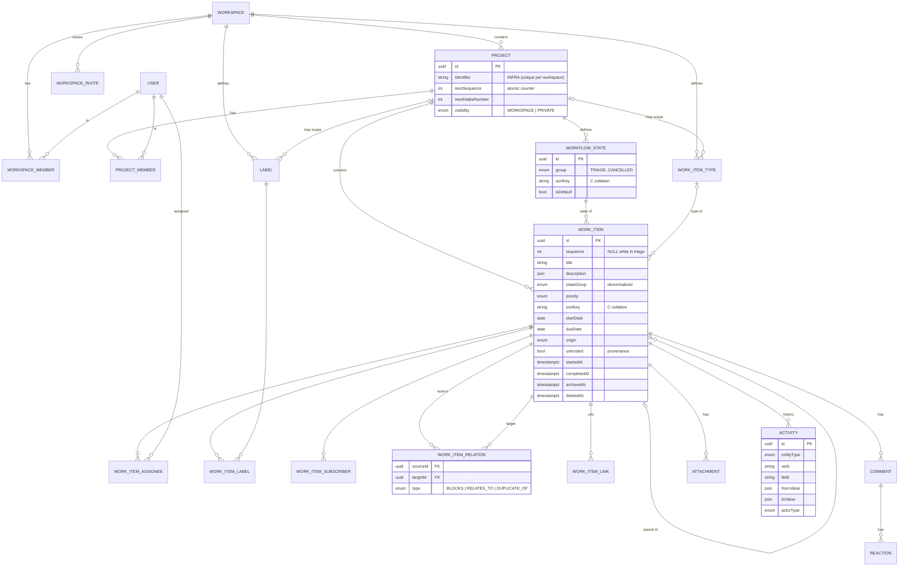
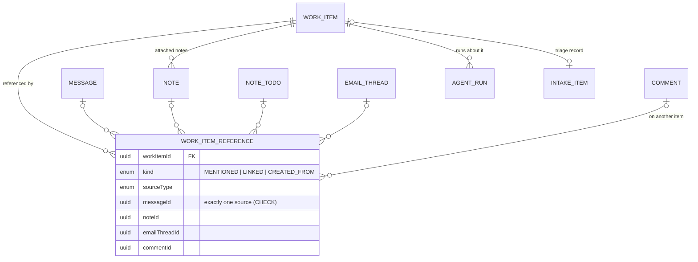
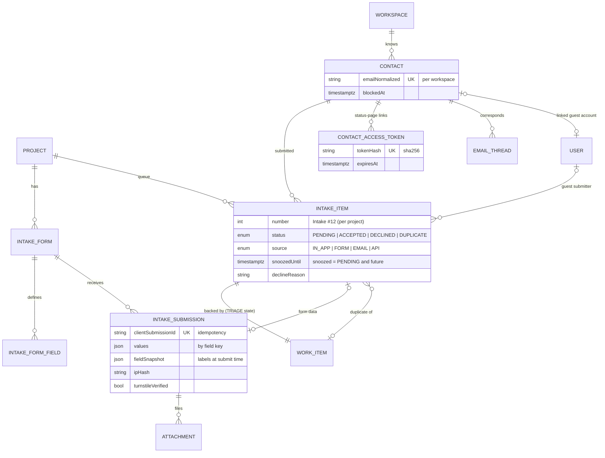
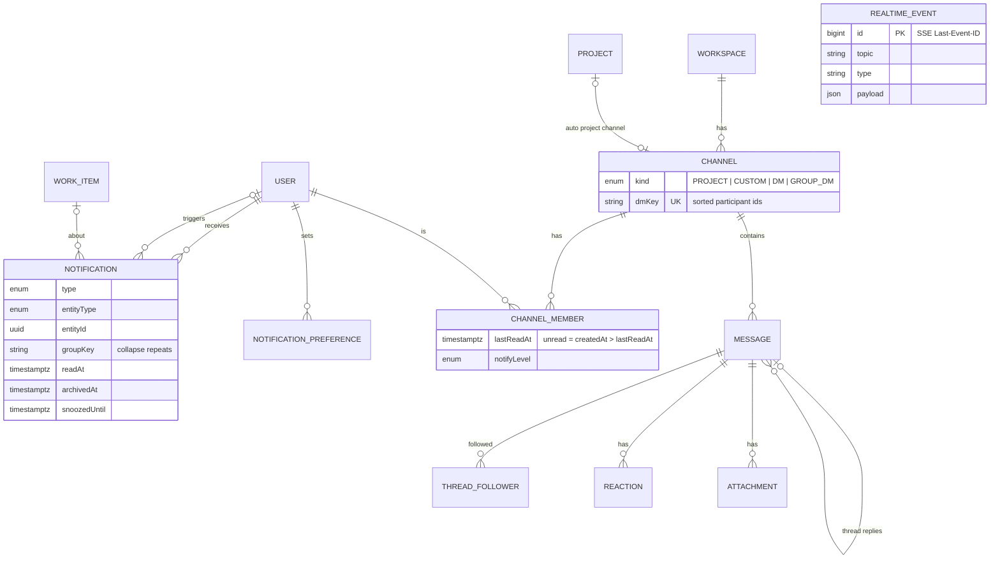
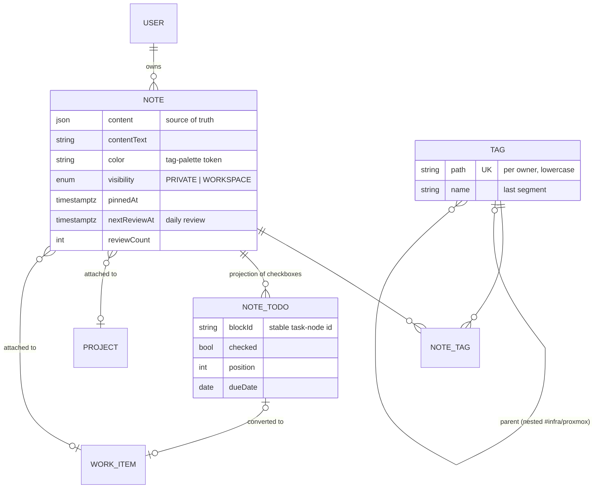
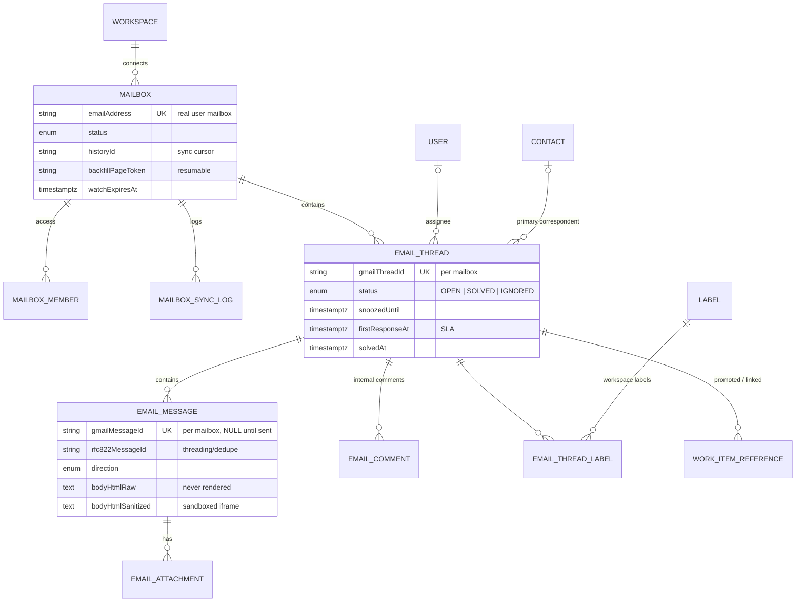
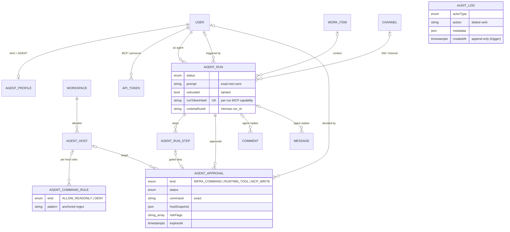
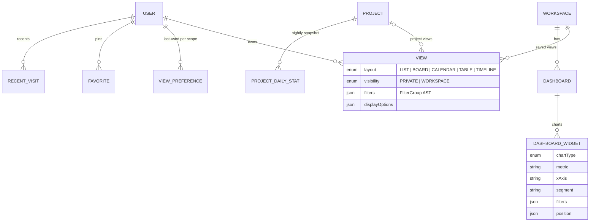

# Dopl: data model

The full schema for **all phases** is in `packages/db/prisma/schema.prisma`: 69 models, validated with Prisma 7.10 and migrated drift-free on PostgreSQL 17.11 + pgvector during Phase 0.

This document explains the shape, the invariants and the reasoning. Decision references (D-xxx) point to `docs/DECISIONS.md`.

## 1. Conventions

| Topic | Rule |
|---|---|
| Primary keys | `uuid(7)` (time-ordered) stored as native `uuid`. Generated by the Prisma client; raw inserts use `uuidv7()` from `@dopl/shared` (D-011) |
| Time | `timestamptz(3)` for instants; `date` for calendar dates (`startDate`, `dueDate`, `NoteTodo.dueDate`) |
| Naming | Models PascalCase; tables snake_case plural (`work_items`); columns camelCase (quote in SQL) (D-012) |
| Tenancy | `workspaceId` on every tenant row. Root entities FK → `workspaces`; child rows carry a denormalized copy set by the domain layer (D-013) |
| Ordering | `sortKey` = fractional-index string, column collation `"C"` (D-014) |
| Archive / delete | `archivedAt` = hidden, restorable; `deletedAt` = trash with a 30-day purge. Config entities (states, labels) are hard-deleted with snapshots kept in Activity (D-020) |
| Rich text | `Json` (Tiptap/ProseMirror) + derived `…Text` column (D-019) |
| Enums | Postgres enums. **Declaration order is sort order** (`Priority`: URGENT → NONE; `StateGroup`: TRIAGE → CANCELLED) |
| JSON columns | Always have a zod schema in `@dopl/shared/schemas`; never read unvalidated |
| Hand-written SQL | `*_manual_*` migrations: `COLLATE "C"`, CHECK constraints, audit trigger, `search` schema (D-015) |

## 2. Domains at a glance

| Domain | Models |
|---|---|
| Auth (Better Auth) | `User`, `Session`, `Account`, `Verification`, `RateLimit` |
| Workspace | `Workspace`, `WorkspaceMember`, `WorkspaceInvite` |
| Projects | `Project`, `ProjectMember`, `WorkflowState`, `WorkItemType`, `Label` |
| Work items | `WorkItem`, `WorkItemAssignee`, `WorkItemLabel`, `WorkItemSubscriber`, `WorkItemRelation`, `WorkItemLink`, `WorkItemReference`, `Comment`, `Reaction`, `Attachment`, `Activity` |
| Views | `View`, `ViewPreference`, `Favorite`, `RecentVisit` |
| Intake | `Contact`, `ContactAccessToken`, `IntakeForm`, `IntakeFormField`, `IntakeItem`, `IntakeSubmission` |
| Inbox & infra | `Notification`, `NotificationPreference`, `OutboundEmail`, `RealtimeEvent`, `Presence`, `RateLimitCounter` |
| Messages | `Channel`, `ChannelMember`, `Message`, `ThreadFollower` |
| Notes | `Note`, `Tag`, `NoteTag`, `NoteTodo` (+ `search.embeddings`, raw SQL) |
| Mail | `Mailbox`, `MailboxMember`, `MailboxSyncLog`, `EmailThread`, `EmailThreadLabel`, `EmailMessage`, `EmailAttachment`, `EmailComment` |
| Agent | `AgentProfile`, `AgentHost`, `AgentCommandRule`, `ApiToken`, `AgentRun`, `AgentRunStep`, `AgentApproval`, `AuditLog` |
| Analytics | `Dashboard`, `DashboardWidget`, `ProjectDailyStat` |
| Integrations | `OutgoingWebhook` (Discord), `WebhookDelivery` |
| Auth plugins (added in Phase 1.4 via the Better Auth CLI) | SSO provider, two-factor tables |

## 3. ER diagrams

The diagrams show key fields and relations only; the schema file is authoritative. `USER` appears in every diagram because nearly everything has an actor.

### 3.1 Workspace, projects and work items



### 3.2 "One place": cross-links around a work item



The work-item timeline is a merge, ordered by time, of:
- `activities`
- `comments`
- `work_item_references` (with the referenced message, note or thread snippet)
- `email_messages` of linked threads
- `agent_runs` (collapsed, expandable into their steps)

It is served by one query per source with a keyset cursor on `createdAt`, merged on the server.

### 3.3 Intake and contacts



**Lifecycle:**

| Step | Changes |
|---|---|
| Submit | `WorkItem(state = TRIAGE, sequence = NULL, origin = INTAKE_FORM, untrusted = true)` + `IntakeItem(PENDING, number = nextIntakeNumber++)` + `IntakeSubmission` + `Contact` upsert |
| Accept | Move to the project's default BACKLOG/UNSTARTED state, assign `sequence = nextSequence++`, optional assignee/labels, `IntakeItem.ACCEPTED`, `triagedBy/At`; notify the submitter (email + status page) |
| Decline | `IntakeItem.DECLINED` + reason. The work item stays in TRIAGE, hidden, reachable from the intake "Declined" tab; the submitter is notified |
| Duplicate | `IntakeItem.DUPLICATE` + `duplicateOfId`; the submitter is notified and linked to the original's public status |
| Snooze | `snoozedUntil`; `snooze.wake` resurfaces the item and notifies the triager |

### 3.4 Inbox, messages and realtime



### 3.5 Notes and to-dos



**Visibility:** a note can be seen by its owner, by every member if `visibility = WORKSPACE`, or by members of its `projectId`, or of the `workItemId`'s project, when attached.

**Tags:** parsed from content on save (`#` followed by a letter, then letters/digits/`-`/`_`/`/`), lowercased, with parent tags created implicitly (`infra` for `infra/proxmox`). Deleting a tag from the tree removes the tag token from the notes' text too; the user confirms first.

**Daily review:** `notes.review` picks up to 5 notes per user where `nextReviewAt <= today` (unpinned, not archived) and weights older and rarely reviewed notes higher. After review, the user can keep the note, which moves `nextReviewAt` out by an increasing interval (1 → 3 → 7 → 21 → 60 days); archive it; snooze it; or convert it.

**Embeddings:** `search.embeddings` (raw SQL, D-017) has columns `(id, workspaceId, entityType, entityId, chunkIndex, contentHash, model, embedding vector(1024), ownerId, projectId, createdAt, updatedAt)` and an HNSW cosine index. `contentHash` skips re-embedding unchanged chunks.

### 3.6 Shared mailbox



### 3.7 AI teammate and audit



### 3.8 Views and analytics



## 4. Key invariants (enforced in `services/*`, tested)

1. `WorkItem.stateGroup == state.group`, updated in the same transaction when an item's state changes or a state's group is edited (a bulk UPDATE).
2. `WorkItem.sequence` is NULL **iff** the item is in the TRIAGE group. Sequences are unique per project and never reused.
3. `WorkItem.startedAt` is set on the first entry into STARTED and never cleared. `completedAt` is set on entry into COMPLETED and cleared when the item leaves it.
4. A parent can't be its own ancestor (cycle check on `parentId` change). Sub-item depth is capped at 5 in the UI.
5. Relations: `sourceId != targetId`. RELATES_TO is stored once, with `sourceId < targetId`. A BLOCKS cycle is allowed but warned about.
6. Each project has exactly one `isDefault` state, at least one state per non-TRIAGE group, and exactly one TRIAGE state (auto-created, not editable).
7. Every `Reaction` and `WorkItemReference` has exactly one target. Every READY `Attachment` has at most one owner (CHECK constraints).
8. `ChannelKind.PROJECT` ⇔ `projectId` is set, and it is unique. A DM's `dmKey` is the sorted pair of member ids.
9. `AuditLog` rows are never updated or deleted (trigger).
10. Counters (`childCount`, `childDoneCount`, `commentCount`, `attachmentCount`, `Note.openTodoCount`, `Message.replyCount`) change only inside the transaction that caused the change.

## 5. Filters, grouping and display options

**Filter AST** (`@dopl/shared/schemas/filters.ts`, stored in `View.filters` and `ViewPreference.filters`):

```ts
type FilterGroup = { op: "and" | "or"; items: Array<FilterGroup | FilterRule> };
type FilterRule = {
  field:
    | "state" | "stateGroup" | "priority" | "type" | "assignee" | "label"
    | "project" | "parent" | "createdBy" | "subscriber"
    | "startDate" | "dueDate" | "createdAt" | "updatedAt" | "completedAt"
    | "estimate" | "title" | "hasSubItems" | "isBlocked" | "origin";
  operator:
    | "is" | "isNot" | "in" | "notIn" | "isEmpty" | "isNotEmpty"
    | "before" | "after" | "between" | "withinLast" | "withinNext" | "contains";
  value?: unknown; // validated per field; supports dynamic tokens: "me", "today", "startOfWeek", …
};
```

The compiler (`domain/filters/compile.ts`) turns the AST into a Prisma `where`, always ANDed with the scope (`workspaceId`, accessible `projectId`s, `deletedAt: null`, `archivedAt: null` unless asked, and `stateGroup != TRIAGE`).

**Quick filters** are preset ASTs:
- My items: `assignee is me`
- Due this week: `dueDate between startOfWeek..endOfWeek`
- Overdue: `dueDate before today AND stateGroup in [BACKLOG, UNSTARTED, STARTED]`
- Unassigned: `assignee isEmpty`

**Display options:**

```ts
type DisplayOptions = {
  groupBy: GroupKey | null;          // "state" | "priority" | "assignee" | "label" | "type" | "parent" | "project"
  subGroupBy: GroupKey | null;       // board swimlanes / nested list groups
  orderBy: { field: "manual" | "priority" | "dueDate" | "startDate" | "createdAt" | "updatedAt" | "title" | "sequence"; dir: "asc" | "desc" };
  showSubItems: boolean;
  showEmptyGroups: boolean;
  completed: "hide" | "recent" | "show"; // default "hide": done/cancelled items are hidden (D-053)
  properties: PropertyKey[];         // visible properties in list/board/table
  density: "comfortable" | "compact";
  table?: { columns: Array<{ id: PropertyKey; width: number }> };
  calendar?: { mode: "month" | "week"; dateField: "dueDate" | "startDate" };
  timeline?: { zoom: "week" | "month" | "quarter" };
};
```

- **Grouping by many-to-many fields** (assignee, label): an item appears in every matching group, plus a "None" group.
- **Dragging across groups** rewrites the grouped property: it removes the source value and adds the target value. For single-valued fields it sets the value.
- **Manual order** uses `sortKey`: the new key is generated between the neighbours' keys *in the rendered order*. That works because keys form one total order per project.

## 6. Index coverage for §4.3 filters and group-bys

| Filter / group / sort | Index |
|---|---|
| project scope + state | `work_items(projectId, stateId)` |
| state group (open/done, overdue) | `work_items(projectId, stateGroup)`, cross-project `(workspaceId, stateGroup, dueDate)` |
| priority | `(projectId, priority)` |
| type | `(projectId, typeId)` |
| assignee ("My items") | `work_item_assignees(userId, workspaceId)` + PK `(workItemId, userId)` |
| label | `work_item_labels(labelId)` + PK |
| parent / sub-items | `(parentId)` |
| created by | `(createdById)` |
| dates (calendar, timeline, due soon) | `(projectId, startDate)`, `(projectId, dueDate)` |
| manual order | `(projectId, sortKey)` |
| created / updated / completed sorting and analytics | `(projectId, createdAt)`, `(projectId, updatedAt)`, `(projectId, completedAt)`, `(workspaceId, completedAt)` |
| title search | GIN trigram on `title` |
| identifier lookup | unique `(projectId, sequence)` + `projects(workspaceId, identifier)` |
| intake queue | `intake_items(projectId, status, createdAt)` |
| inbox | `notifications(recipientId, archivedAt, createdAt)`, `(recipientId, readAt)` |
| mail views | `email_threads(mailboxId, status, lastMessageAt)`, `(assigneeId, status)` |
| chat history | `messages(channelId, createdAt)`, `(threadRootId, createdAt)` |
| my notes / review | `notes(ownerId, deletedAt, archivedAt, updatedAt)`, `(ownerId, nextReviewAt)` |
| my to-dos | `note_todos(ownerId, checked, dueDate)` |
| agent approvals queue | `agent_approvals(workspaceId, status, requestedAt)` |

Postgres combines indexes with bitmap AND/OR for multi-filter views. For 10k+ row tables, the table view pages with keyset cursors on `(orderField, id)`, and virtualization renders only the visible rows.

**Phase 2 check:** `EXPLAIN ANALYZE` on the seeded dataset scaled to 50k items. Every view query must stay under 50 ms at p95. Add composite or partial indexes (in a manual migration) as the measurements show.

## 7. Sequences and identifiers

- `Project.identifier` is `^[A-Z][A-Z0-9]{1,9}$`, unique per workspace. When it's renamed, the old value is appended to `previousIdentifiers`, so `#OLD-12` references still resolve.
- Allocation happens inside the accept or create transaction:
  ```sql
  UPDATE projects SET "nextSequence" = "nextSequence" + 1
  WHERE id = $1 RETURNING "nextSequence" - 1 AS seq
  ```
  The row lock serializes concurrent creates in the same project, which is cheap at our volume. Intake numbers work the same way with `nextIntakeNumber`.

## 8. Retention

| Data | Retention |
|---|---|
| Soft-deleted rows (`deletedAt`) | 30 days → hard purge (Q-11) |
| `realtime_events` | 24 hours |
| `presences` | expired rows pruned every 10 min |
| `rate_limit_counters` | expired windows pruned nightly |
| `outbound_emails` | 90 days |
| `mailbox_sync_logs` | 30 days |
| Agent step output (object storage) | 180 days; DB head kept with the run |
| `audit_logs`, `activities` | kept (export + archive policy to decide, Q-11) |

## 9. Seed data (Phase 1)

`packages/db/src/seed` creates a realistic data set. It's deterministic (fixed PRNG seed), so screenshots are stable:
- 1 workspace ("Acme IT") with 8 members: the owner, admins, members, 2 guests, and the agent user
- 5 projects: INFRA, NET, HELP, SEC, DEV. Each gets default states, labels from the tag palette and the default types
- about 300 work items with a realistic spread:
  - titles from an IT-ops phrase bank
  - sub-items, BLOCKS relations and assignees
  - due dates around "today"
  - comments and activity history
- intake forms and pending intake items with contacts
- a few notes with tags and to-dos (Phase 5 data is seeded early so the Home page can be designed)
